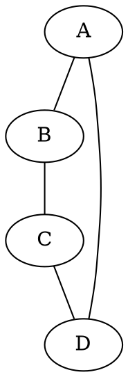
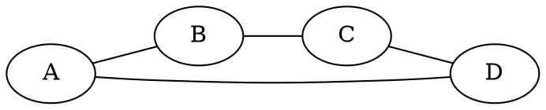
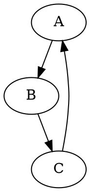
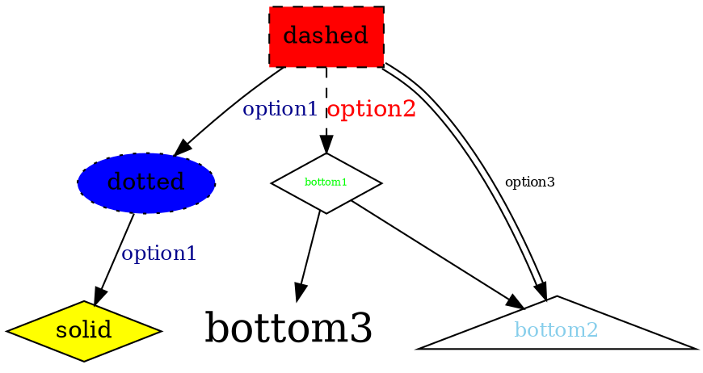
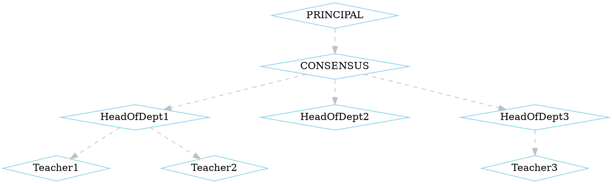
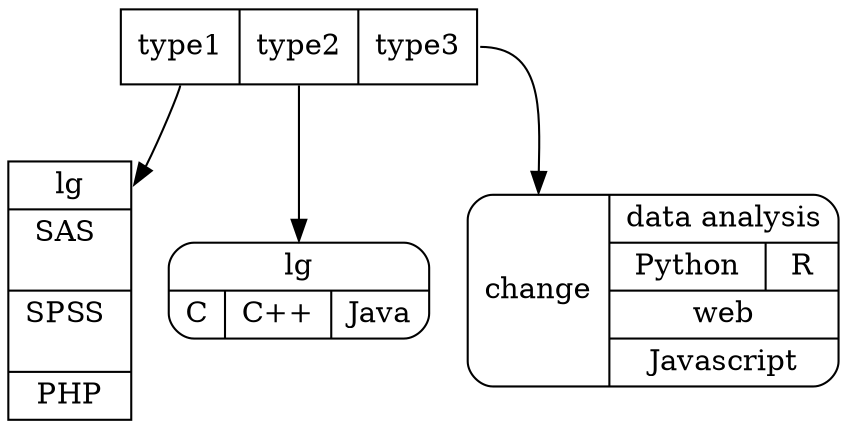
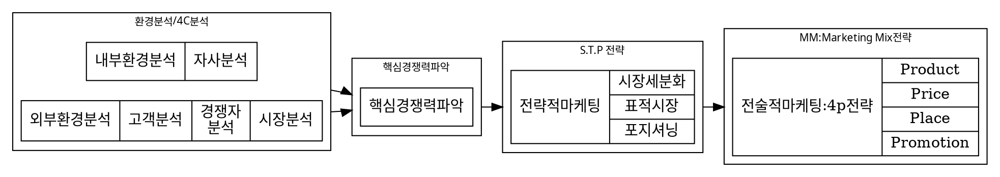

노트북을 이용해 필기를 하거나 웹에 파일을 올릴 경우에 그래프가 필요한 경우가 종종 있습니다. 예를 들어 어떤 두 개념 사이의 관계를 적어놓고 싶다면 노트에 필기를 한다면 펜으로 금방 하겠지만 노트북을 이용하여 시각적으로 그려내는 것은 쉽지 않습니다. **DOT(graph description language)** 는 웹 상에서 그래픽적 형태를 그려낼 수 있는 언어입니다. 그리고 DOT를 웹 상에 렌더링하기 위해서 Graphviz라는 라이브러리 뭉치가 사용됩니다.예를 들면 Graphviz에 속하는 파일인 Viz.js는 Javascript를 통해서 웹에 DOT를 렌더링해 줍니다. 이 포스팅에서는 DOT의 기본 문법을 다루겠습니다.

## Simple example

### Directed, Undirected graph
undirected graph는 ```graph```로, directed graph는 ```digraph```를 통해 만든다. 또한 ```rankdir```를 통해서 레이아웃을 바꿀 수 있다. 레이아웃의 기본값은 top-bottom이다.

```java
graph graphname {
  A -- B;
  B -- C;
  C -- D;
  A -- D;
}
```

```java
graph graphname {
  rankdir=LR;
  A -- B;
  B -- C;
  C -- D;
  A -- D;
}
```

```java
digraph graphname {
  A -> B;
  B -> C;
  C -> A;
}
```


### Label of node/edge, color, shape etc

주요 옵션
* ```label``` : node/edge 라벨
* ```color```  
* ```shape``` : box, ellipse, triangle, diamond, none ...
* ```color``` : 테두리 색
* ```fontcolor/fontsize```
* ```style``` : filled(color of background), invisible, diagonals, rounded, dashed, dotted, solid(last 4 options determine outline style)
* ```fillecolor``` : background color

```java
digraph graphname {
  A[label="dashed", style="dashed, filled", shape="box", fillcolor=red]
  B[label="dotted", style="dotted, filled", shape="ellipse", fillcolor=blue]
  C[label="solid", style="solid, filled", shape="diamond", fillcolor=yellow]

  D[label="bottom1", style="solid", shape="diamond", fontsize=6, fontcolor=green]
  E[label="bottom2", style="solid", shape="triangle", fontsize=12, fontcolor=skyblue]
  F[label="bottom3", fontsize=24, shape="none"]

  A->B->C[label="option1" fontcolor=darkblue, fontsize=12];
  A->D[label="option2" fontcolor=red style=dashed]
  A->E[label="option3" fontsize=8 color="black:invis:black"]
  D->E;
  D->F;  
}
```

## Advanced example

### 전체 node, edge 옵션 조정
이를 위해 ```node```, ```edge```를 이용한다.
```java
digraph graphname {
  nodesep=1.0

  node[color=skyblue, shape=diamond]
  edge[color=gray, style=dashed]

  PRINCIPAL->CONSENSUS;
  CONSENSUS->{HeadOfDept1 HeadOfDept2 HeadOfDept3}
  HeadOfDept1->{Teacher1 Teacher2}
  HeadOfDept3->Teacher3
}
```



### 블록 분리(Block seperation)

node를 구획하여 데이터를 담을 수도 있습니다. ```|```를 이용하여 분리하고 node 설정을 ```shape=record```로 바꾸어야 합니다. ```{}```은 원래 블록이 쌓이고 있는 방향을 한 번 반대로 뒤집는 역할을 합니다.

```java
  digraph block {
    node[shape=record]
    str1 [label="<t1> type1 | <t2> type2 | <t3> type3"];
    str2 [label="{<head> lg | SAS \n\n| SPSS \n\n | PHP}"];
    str3 [label="{<head> lg | {C | C++ | Java } }" shape=Mrecord];
    str4 [label="<head> change| {data analysis | {Python | R} | web | Javascript}" shape=Mrecord]

    str1:t1 -> str2:head;
    str1:t2 -> str3:head;
    str1:t3 -> str4:head;

}
```


###  부그래프(subgraph)

서로 다른 단계를 효과적으로 표현하기 위해서 그래프를 구획하여 이름을 붙일 수도 있다. 이 부분을 *subgraph* 라고 부릅니다. 꼭 필요한 설정이 몇 가지 있습니다.

* *subgraph* 는 반드시 ```cluster_NAME```으로 이름을 써주어야 합니다.
* ```node1 -> node2 [ltail=cluster_NAME1 lhead=cluster_NAME2]```을 통해 클러스터끼리 직접적인 연결이 가능합니다.
* 위와 같은 경우에 ```graph[compound=true];```설정이 들어가야 클러스터 박스끼리 연결됩니다.

예를 들어 기업에서 마케팅하는 경우를 생각하여 보면 전체적 흐름에서 크게 분기점이 있고 각각 세부 과정이 있으므로 분기점별로 세부 과정을 묶어주는 작업을 해준다면 더 보기 좋을 것 입니다. 그 과정을 그래프로 그려보겠습니다.


